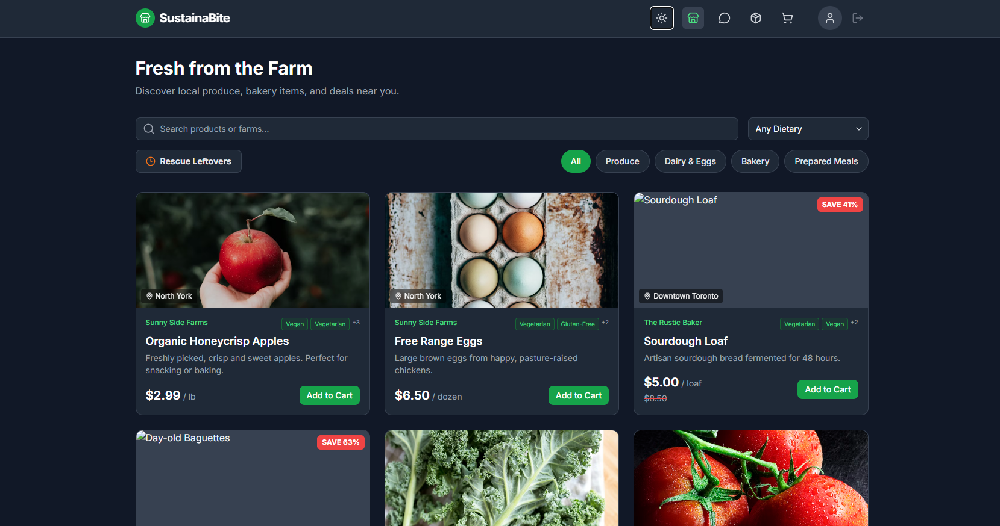
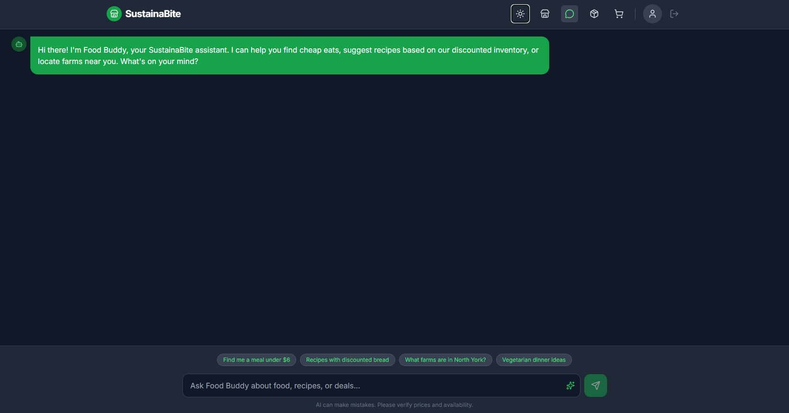
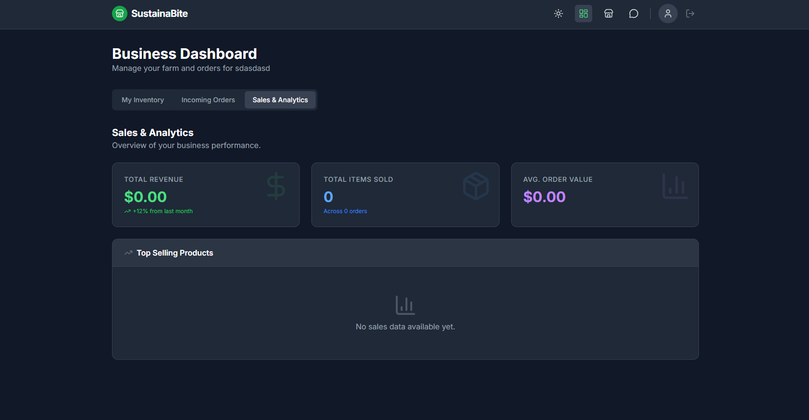
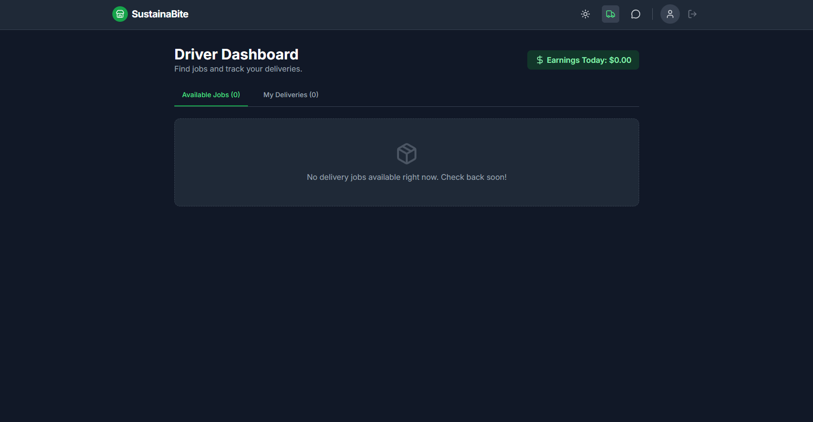

# 🍎 SustainaBite
Second place winner @ Vibe the Code ElleHacks 2025

SustainaBite is a circular economy food platform that optimizes the connection between local farmers, businesses, and consumers by utilizing artificial intelligence to minimize food waste and streamline regional delivery logistics.
- [DevPost](https://devpost.com/software/sustainabite-of4zcx)
- [Vercel](https://sustainabite-seven.vercel.app/)

## 🌍 Overview
SustainaBite is an AI-powered food platform that uses the Gemini 2.5 Flash model to optimize perishable inventory, surface surplus via “Rescue Mode” discounts, and coordinate real-time local delivery to reduce food waste.


## 📸 Screenshots
<p align="center">
  
  
  
  
</p>

## ✨ Key Features
- **AI-Powered "Food Buddy" Assistant**: Gemini-powered chatbot with Google Maps grounding for inventory-aware recipes and local search.
- **Triple-Role Ecosystem**: 
  - **Consumers**: Browse local listings, track deliveries, access eco-discounts.
  - **Businesses**: Manage inventory, orders, and sales analytics.
  - **Drivers**: Accept delivery jobs with navigation and live status.
- **Dynamic "Rescue Mode"**: Dynamic filtering of surplus inventory with discounted pricing.
- **Profit & Sales Analytics**: Revenue, product performance, and customer insights.
- **Modern Responsive UI**: Mobile-first design with Light/Dark mode and optimized state management.

## ⚠️ The Problem
Local food systems face last-mile inefficiencies that cause producers to discard surplus inventory while consumers deal with rising costs and limited sourcing transparency. SustainaBite addresses this by:
- **Monetizing Surplus**: Creating a secondary market for surplus and cosmetically imperfect produce.
- **Reducing Friction**: Automating coordination between producers, couriers, and consumers.
- **AI-Driven Education**: Guiding consumers to cook with locally available ingredients.

## 🛠️ Tech Stack
**Frontend**:
- React 19
- TypeScript
- Tailwind CSS
- Lucide React

**AI Integration**: 
- Google Gemini 2.5 Flash API

**Architecture**: 
- ES6 Modules with Import Maps

## 🚀 How to Run
### Prerequisites
- Node.js (v18 or higher)
- Google Gemini API key

### Installation
```bash
# Clone the repository
git clone https://github.com/sutr4/sustainabite
cd sustainabite

# Install dependencies
npm install
```
Environment Setup:
Create a `.env` file in the root directory and add your Google AI Studio API Key:
```env
API_KEY=your_gemini_api_key_here
```
Start your development server:
```bash
npm run dev
```

## ⚙️ How It Works
1. **Authentication**: Users register as Consumers, Businesses, or Drivers with role-based UI enforcement.
2. **Inventory Sync**: Business listings are ingested into the AI system context via `GeminiService`.
3. **AI-Grounded Chat**: Recipe suggestions are generated using real-time local inventory.
4. **Order Flow**:
   - `CONFIRMED` → Order placed
   - `PREPARING` → Business accepts
   - `ON_THE_WAY` → Driver assigned with live tracking
   - `DELIVERED` → Order completed

## 🧠 What We Learned
- **Contextual AI Engineering**: Grounding AI responses using RAG-like patterns with real-time inventory data.
- **Cross-Role UX Design**: Synchronizing state changes across Consumer, Business, and Driver interfaces.
- **Sustainability-Driven Design**: Reducing waste through behavior nudges like “Rescue Mode.”

## 👥 Team
- **Tracy Su** - [GitHub](https://github.com/sutr4) | [LinkedIn](https://linkedin.com/in/tracysu6)
- **Khushi Maan** - [GitHub](https://github.com/Khusheemaan) | [LinkedIn](https://www.linkedin.com/in/khushi-maan-729a89284/)
- **Aqeelah Ghadiyali** - [GitHub](https://github.com/Kot-ux) | [LinkedIn](https://www.linkedin.com/in/aqeelah-ghadiyali-202410362/)

## 🙏 Acknowledgments
- Thanks to [ElleHacks](https://ellehacks.com/) for hosting this amazing hackathon!